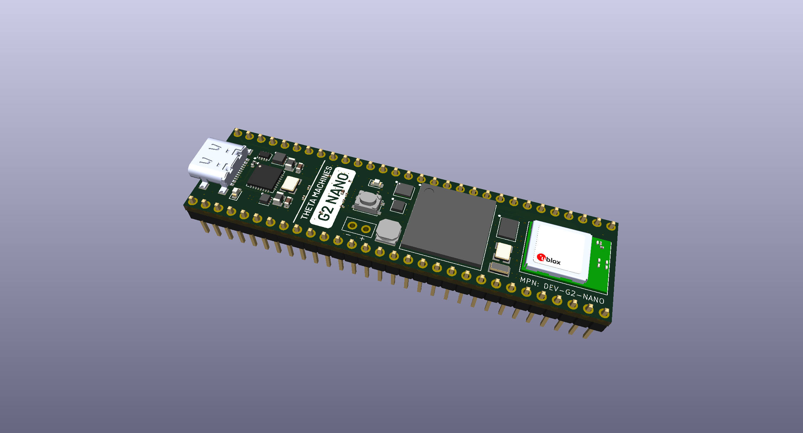

# G2 Nano Development Board
This repository houses the KiCad source files for the G2 Nano microcontroller development board.

The G2 Nano is powered by a record-breaking 1 GHz Arm Cortex-M7 processor, combining the performance of an application processor with real-time determinism. Purpose-built for robotics R&D, the board integrates dual-band Wi-Fi, an inertial measurement unit, and an on-board closed-loop motion controller.  Which will be used to control my Robot

## Overview
* This PCB was designed using KiCad 10 and it's standard library of components.

* The KiCad project is contained within the `kicad/` directory and can be opened via the `kicad/DEV-G2-NANO.kicad_pro` file.

* All custom symbols and footprints are located in the `kicad/project_lib/` directory. The same directory houses the schematic page template.

## Features
### Performance
* 1 GHz Arm Cortex-M7 Microprocessor
* Double-Precision Floating Point Unit
* 2 MiB RAM (512 KiB Tightly Coupled)
* 8 MiB QSPI Flash Memory
* Cryptographic Acceleration (Including Random Number Generation)
* Two 32-Channel DMA Engines

### Peripherals
* Dual-Band Wi-Fi
* 6-Axis IMU (3-Axis Accelerometer; 3-Axis Gyroscope)
* 3-Axis Magnetometer
* 3-Axis Closed-Loop Motion Controller <!-- TODO: provide link to part -->
* Real-Time Clock (Optionally powered with a coin cell battery)
* Built-In Hardware Debugger

### Digital I/O
* 40 Digital GPIO
* 2 CAN/CAN-FD Interfaces
* 3 I2C Interfaces
* 2 SPI Interfaces
* 5 UART Interfaces

### Analog & Audio
* 10 Analog Inputs
* 2 I2S/TDM Interfaces
* S/PDIF Interface

## Using This Project
*This section is an informal summary of the license. For the full terms, see the `LICENSE.txt` file.*

The design files in this repository are licensed under the *CERN Open Hardware Licence Version 2 - Permissive* (CERN-OHL-P-2.0).

You are free to:
* Study these files and use them as inspiration or reference for your own independently created designs. As long as you are not copying, modifying, or redistributing the licensed design files, then you are not required to give attribution or license your design under the same terms.

* Copy, modify, and redistribute these files, including under different terms, provided you comply with the CERN-OHL-P-2.0 requirements.

